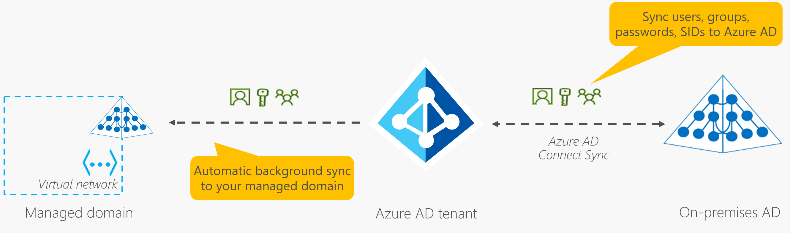
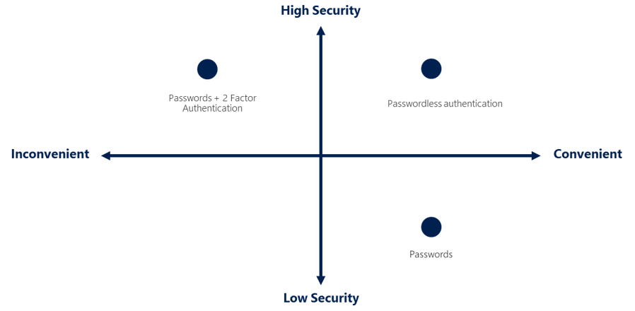
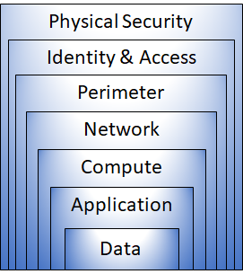
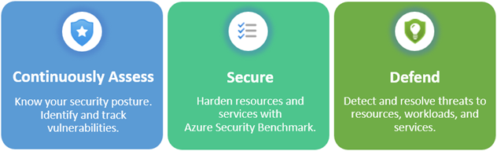

# Describe Azure identity, access and security

## Describe Azure directory services

### Microsoft Entra ID

- sign-in and access both Microsoft cloud applications and cloud applications that you develop
- maintain your **on-premises** Active Directory deployment
- can detect sign-in attempts from unexpected locations or unknown devices.
- Active Directory (Windows Server)
    - provides an identity and access management service

- Who uses Microsoft Entra ID
    - **IT Administrator**
    - **App Developers**
    - **Users**
    - **Online Service subscribers**
- What does Microsoft Entra ID do?
    - Authentication
    - Single-Sign-on
    - Application Management (cloud and on-premises apps)
    - Device Management

### **What is Microsoft Entra Domain Services?**

- Provides managed domain services (domain join, group policy, LDAP)
- run legacy applications in the cloud that can't use modern authentication methods
- Microsoft Entra Domain Services integrates with your existing Microsoft Entra tenant.

**How does Microsoft Entra Domain Services work?**

- Unique namespace is the domain name to be defined
- Two Windows Server domain controllers are then deployed into your selected Azure region (replica set
- **one-way synchronization** from Microsoft Entra ID to Microsoft Entra Domain Services.

## Describe Azure authentication methods

- Authentication is the process of establishing the identity of a person, service, or device.
- standard passwords, single sign-on (SSO), multifactor authentication (MFA), and passwordless.
- security ↔ convenience.

### SSO

Single sign-on (SSO) enables a user to sign in one time and use that credential to access multiple resources and applications from different providers.

### **MFA**

Multifactor authentication is the process of prompting a user for an extra form (or factor) of identification during the sign-in process. 

- security questions, code sent to the user’s mobile phone, biometric property
- Microsoft Entra multifactor authentication

### **Passwordless Authentication**

the password is removed and replaced with something you have, plus something you are, or something you know.

needs to be set up on a device 

- Windows Hello for Business
    - The biometric and PIN credentials are directly tied to the user's PC, which prevents access from anyone other than the owner.
    - You may already be using the Microsoft Authenticator App as a convenient multifactor authentication option in addition to a password.
- Microsoft Authenticator app
    - The Authenticator App turns any iOS or Android phone into a strong, passwordless credential
- FIDO2 security keys
    - FIDO allows users and organizations to leverage the standard to sign-in to their resources without a username or password by using an external security key or a platform key built into a device.

## Describe Azure external identities

An external identity is a person, device, service, etc. that is **outside your organization**

- Business to business (B2B)
    - Collaborate with external users by **letting them use their preferred identity to sign-in to your Microsoft applications** or other enterprise application, guest users
- B2B direct connect
    - Establish a **mutual, two-way trust with another Microsoft Entra organization** for seamless collaboration.
- Microsoft Azure Active Directory business to customer (B2C)
    - Publish **modern SaaS apps or custom-developed apps** (excluding Microsoft apps) to consumers and customers

## Describe Azure conditional access

Conditional Access is a tool that Microsoft Entra ID uses to **allow (or deny) access to resources** based on **identity signals.**

- who, where and what device the user is requesting access from.
- a more granular multifactor authentication experience for users

When to use?

- Require MFA depending on the requester’s **role, location or network**
- Require access to services only t**hrough approved client applications.**
- Require users to access your application onl**y from managed devices.**
- lock access from untrusted sources, **unknown locations**

## Describe Azure role-based access control

The principle of least privilege says **you should only grant access up to the level needed to complete a task**

Azure provides built-in roles that describe common access rules for cloud resources.

### How role-based access control applied to resources

### How is Azure RBAC enforced

- Resource Manager, access it from Azure portal, Cloud Shell, PowerShell, CLI
- Azure RBAC **doesn't enforce access permissions at the application or data level.** Application security must be handled by your application.
- It uses an allow model (related to a role assigned to perform action)

## Describe zero trust model

Zero Trust is a security model that **assumes the worst case scenario** and **protects resources with that expectation.** 

- Verify explicitly , Always authenticate and authorize
- Use least privilege access ( Just-In-Time and Just-Enough-Access (JIT/JEA))
- Assume breach

## Describe defenese-in-depth

to protect information and prevent it from being stolen by those who aren't authorized to access it.

**Physical Security**, computing hardware, data center

**Identity and access,** control access to infrastructure, SSO, MFA

**Perimeter,**  protects from network-based attacks. DDos Protection, perimeter firewall

**Network,** the focus is on limiting the network connectivity across all your resources to allow only what's required

**Compute,  secure access to VM,** endpoint protection on devices and keep system patched and current

**Application,** application free of vulunerabilities, sensitive application secrets in a secure storage system

**Data,**  confidentiality, integrity, and availability of the data.

## Describe Microsoft Defender for Cloud

Defender for Cloud is **a monitoring tool for security posture management and threat protection**. It monitors your **cloud, on-premises, hybrid, and multi-cloud environments** to provide guidance and notifications aimed at strengthening your security posture.

Defender for Cloud helps you detect threats across:

- Azure Pass Services
- Azure data services
- Networks

Defender for Cloud capabilities to your hybrid cloud environment to protect your non-Azure servers. 

### **Defend resources running on other clouds**

- AWS, GCP

### **Assess, Secure, and Defend**

