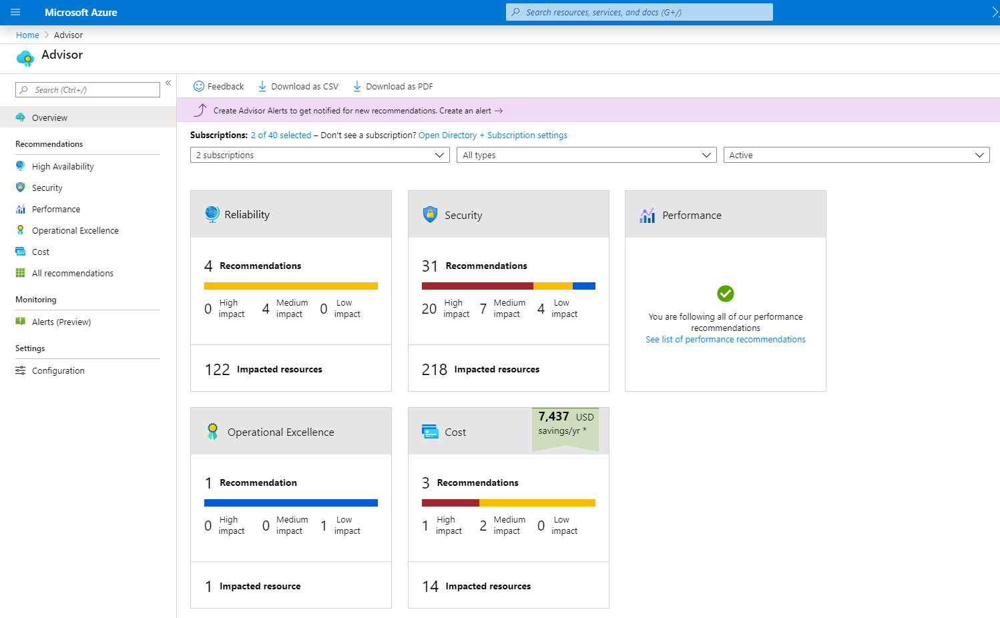

# Describe monitoring tools in Azure

## Describe the purpose of Azure Advisor

Azure Advisor **evaluates your Azure resources** and **makes recommendations t**o help improve reliability, security, and performance, achieve operational excellence, and reduce costs.

- Reliability,  improve the continuity of your business-critical application
- Security, detect threats and vulnerabilities/breaches
- Performance,  improve the speed of your applications.
- Operational Excellence, **workflow efficiency, resource manageability, and deployment best practices.**
- Cost

## Describe Azure Service Health

Azure Service Health helps you keep track of Azure resource, both your specifically deployed resources and the overall status of Azure

- Azure Status
    - informs you of **service outages** in Azure on the Azure Status page.
- Service Health
    - It focuses on the Azure services and regions you're using.
    - impacting communications about outages, planned maintenance activities, and other health advisories
- Resource Health
    - It provides information about the health of your individual cloud resources, such as a specific virtual machine instance.

## Describe Azure Monitor

Azure Monitor is a platform for **collecting data on your resources**, **analyzing that data,** **visualizing the information**, and even acting on the results.

### Azure Log Analytics

- run **log queries** on the data gathered by Azure Monitor
- sort, filter, analyze the records

### Azure Monitor Alerts

- an automated way to stay informed when Azure Monitor detects a threshold being crossed
- monitor the logs and trigger on certain log events, CPU usage 80%
- use **action groups** to configure who to notify and what action to take. An action group is simply a collection of notification and action preferences that you associate with one or multiple alerts.

### Application Insights

- an Azure Monitor feature, monitors your web applications
- Application Insights is capable of monitoring applications that are running in Azure, on-premises, or in a different cloud environment.
    - Request Rate. response times, failure rates
    - Dependency rates, response times
    - page views, load performance,
    - Ajax calls from web pages, rate
    - User/sessions counts
    - performance counters  (CPU, MEMORY, NETWORK USAGE)